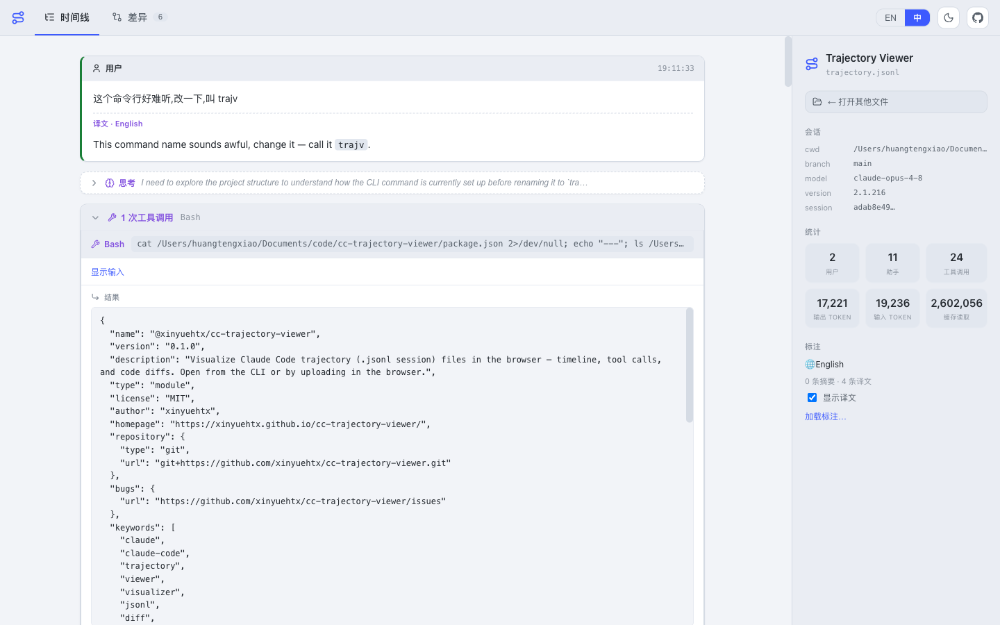
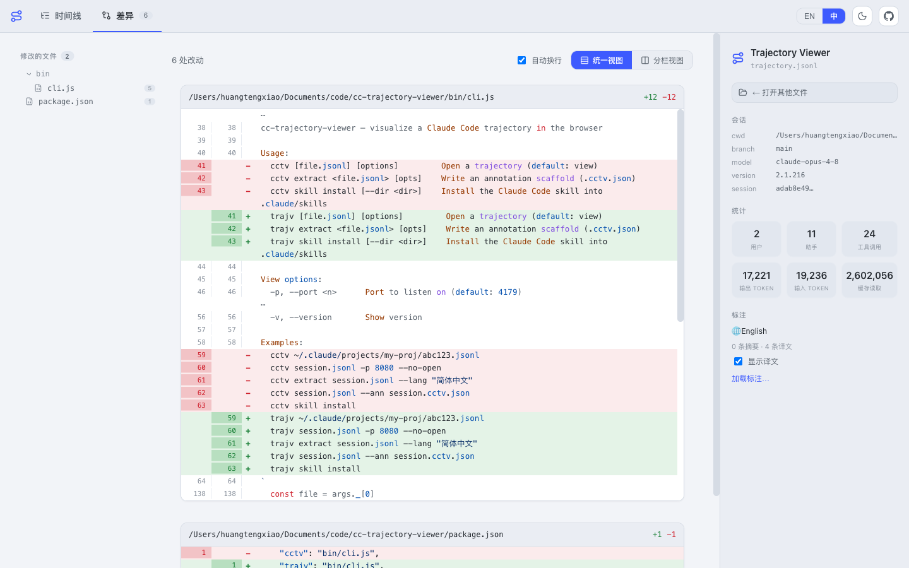

# Claude Code Trajectory Viewer

**English** · [简体中文](README.zh-CN.md)

Visualize [Claude Code](https://claude.com/claude-code) **trajectory** files —
the `.jsonl` session logs Claude Code writes under `~/.claude/projects/` — as a
clean, readable web UI. See the full timeline of user prompts, assistant replies,
thinking blocks, tool calls, and tool results. When a session edits files, view
the changes as **red/green code diffs**.

**Live demo:** <https://xinyuehtx.github.io/cc-trajectory-viewer/> (drag-and-drop a `.jsonl`)

> 🔗 **Sister project — [Harbor Trajectory Viewer](https://github.com/xinyuehtx/harbor-trajectory-viewer)**
> The same idea for **Harbor's ATIF** (Agent Trajectory Interchange Format) `.json` trajectories:
> a browser viewer with a timeline, token/cost metrics, subagent drill-down, and per-file diffs.
> _([Harbor](https://github.com/harbor-framework/harbor) is a framework for evaluating and improving AI agents — the official Terminal-Bench 2.0 harness.)_
> If this tool helps you, give **[harbor-trajectory-viewer](https://github.com/xinyuehtx/harbor-trajectory-viewer)** a ⭐ too.

## Screenshots

| Timeline | Diffs |
| --- | --- |
|  |  |

Light theme — aggregated per-file diffs with a directory tree:



## Features

- 🧭 **Timeline tab** — user / assistant messages and collapsible thinking, with **consecutive tool calls grouped into collapsible clusters** so the conversation stays readable
- 🌈 **Diffs tab** — every file change (`Edit`, `MultiEdit`, `Write`, `NotebookEdit`) as a syntax-highlighted diff, switchable between **unified (single-column)** and **split (two-column)** views
- 🔧 **Tool calls** — compact summaries with expandable inputs and (truncatable) results; edit calls link straight to their diff
- 🌐 **Annotations (agent skill)** — generate a sidecar that adds a **one-line summary per tool-call cluster** and a **translation of every message** into a target language, shown alongside the original
- 📊 **Session sidebar** — cwd, git branch, model, version, token usage, and a jump-to list of modified files
- 🖥️ **Two ways in** — open a file from the CLI, or drag-and-drop / upload in the browser (works fully static, e.g. on GitHub Pages)
- 🔒 **Local-only** — the CLI serves everything from `localhost`; nothing is uploaded

## Quick start (CLI)

No install required:

```bash
npx @xinyuehtx/cc-trajectory-viewer ~/.claude/projects/<project>/<session>.jsonl
```

Or install globally:

```bash
npm install -g @xinyuehtx/cc-trajectory-viewer
trajv path/to/session.jsonl
```

Run with no argument to open the browser in upload mode:

```bash
trajv
```

### CLI

```
trajv [file.jsonl] [options]         Open a trajectory (default)
trajv extract <file.jsonl> [opts]    Write an annotation scaffold (.trajv.json)
trajv skill install [--dir <dir>]    Install the Claude Code skill into .claude/skills

View options:
  -p, --port <n>   Port to listen on (default: 4179)
  -a, --ann <f>    Annotation JSON to overlay (default: <file>.trajv.json if present)
      --no-open    Do not open the browser automatically

Extract options:
  -o, --out <f>    Output path (default: <file>.trajv.json)
      --lang <s>   Target language recorded in the scaffold (e.g. "简体中文")

  -h, --help       Show help
  -v, --version    Show version
```

## Where are trajectory files?

Claude Code stores each session at:

```
~/.claude/projects/<encoded-cwd>/<sessionId>.jsonl
```

`<encoded-cwd>` is your project's absolute path with `/` and `.` replaced by `-`.
To open the most recent session for the current project:

```bash
DIR="$HOME/.claude/projects/$(pwd | sed 's#[/.]#-#g')"
trajv "$(ls -t "$DIR"/*.jsonl | head -1)"
```

## Use with a browser only

The viewer is a static SPA — no backend needed. Open the
[live demo](https://xinyuehtx.github.io/cc-trajectory-viewer/) (or your own Pages
deploy) and drag a `.jsonl` file onto the page. You can also point it at a hosted
file via `?src=<url>`.

## Annotations: summaries & translations

The viewer can overlay a sidecar `*.trajv.json` that adds a one-line **summary**
for each cluster of consecutive tool calls and a **translation** of each message.
The `view-trajectory` skill drives an agent to produce it, or you can do it by hand:

```bash
# 1) scaffold — enumerates every message + tool-call cluster, correctly keyed
trajv extract session.jsonl --lang "简体中文"

# 2) fill in the empty "summary" / "translation" fields in session.jsonl.trajv.json

# 3) view — the sibling .trajv.json is auto-loaded
trajv session.jsonl
```

Summaries show in each cluster's header; translations appear beneath each message
(toggle in the sidebar). Only `summary` / `translation` fields are meant to be
edited — the `id` / `original` / `tools` fields bind each annotation to the UI.

## Claude Code skill

The package bundles a skill at `skill/view-trajectory/`. Install it into a
project's (or user-level) `.claude/skills/`:

```bash
trajv skill install            # into ./.claude/skills
trajv skill install --dir ~    # into ~/.claude/skills (all projects)
```

Then Claude Code can, on request — *"view this session's trajectory"* or
*"summarize and translate this trajectory to Chinese"* — locate the newest
`.jsonl`, optionally generate annotations, and open the viewer.

## Development

```bash
pnpm install
pnpm dev           # Vite dev server (upload mode)
pnpm build         # -> dist/
node bin/cli.js path/to/session.jsonl   # test the CLI against a real build
pnpm typecheck
```

Stack: React 18 + Vite + TypeScript. Markdown via `marked` + `DOMPurify`, syntax
highlighting via `highlight.js`, diffs via `diff` (jsdiff). The CLI (`bin/cli.js`)
uses only Node.js builtins.

## Deploy your own (GitHub Pages)

Push to `main`; the [Pages workflow](.github/workflows/deploy-pages.yml) builds and
deploys automatically. In the repo settings, set **Pages → Source → GitHub Actions**.
The build uses `base: './'` so it works from any subpath.

## Publishing to npm

Publishing is automated by [`npm-publish.yml`](.github/workflows/npm-publish.yml):
add an `NPM_TOKEN` repo secret, then create a GitHub Release. Or publish manually:

```bash
npm login
npm publish --access public   # runs the build via prepublishOnly
```

## Trajectory format

Each line is a JSON object. The viewer renders `user`, `assistant`, and `system`
lines and ignores bookkeeping lines (`queue-operation`, `mode`, `file-history-*`,
etc.). Assistant content blocks are `thinking` / `text` / `tool_use`; tool results
arrive on later `user` lines as `tool_result` blocks and are matched back to their
`tool_use` by id.

## License

MIT © xinyuehtx
